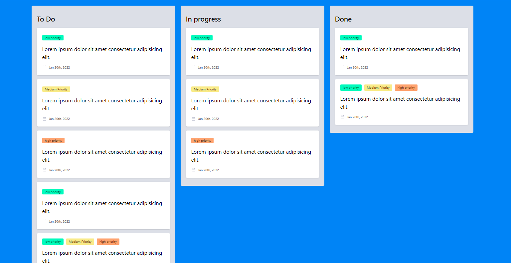

# Trello-Board
## Project Overview
This is a Trello-board project that can be able to read created todos, todos in progress and todos that have been completed hence displaying them separately each category state in it's tire.

## Tech Stack
The project is built with HTML for the markup and Tailwind CSS for the styling, No JavaScript.

## Screenshots
### Desktop View

## Link
 - Live Site:[Live Site](https://devjhex-trello-board.vercel.app/) 